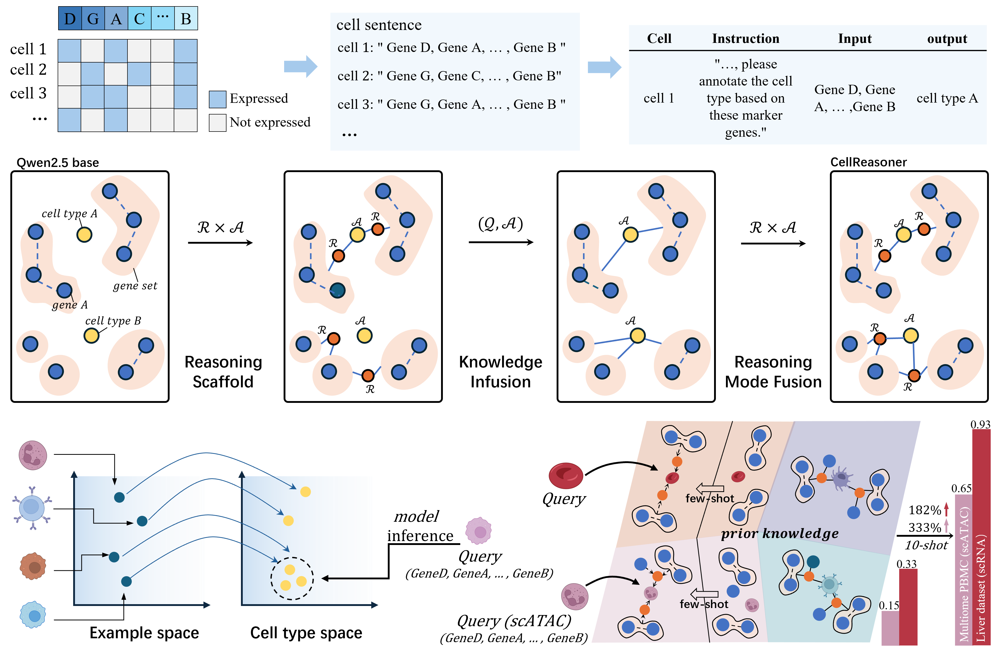

# CellReasoner: A reasoning-enhanced large language model for cell type annotation 🧬🧠

<div align="center">

[📄 Paper](https://www.biorxiv.org/content/10.1101/2025.05.20.655112v1) | [📊 Dataset](#-training-data) | [🤖 Model](https://huggingface.co/guangshuo/CellReasoner-7B)

</div>

---

<div align="center">
  
</div>


---
## 📌 Table of Contents

- [📖 CellReasoner: A reasoning-enhanced large language model for cell type annotation 🧬🧠](#cellreasoner-a-reasoning-enhanced-large-language-model-for-cell-type-annotation-🧬🧠)
  - [📌 Table of Contents](#-table-of-contents)
  - [🔬 Key Highlights](#-key-highlights)
  - [🔑 Key Results](#-key-results)
  - [🧠 Model Zoo](#-model-zoo)
  - [🏋️‍♂️ Training](#-training)
  - [📚 Training Data](#-training-data)
  - [🚀 Usage](#-usage)
  - [📚 Citation](#citation)

---

### 🔬 Key Highlights

- Only **a few expert-level reasoning samples** are needed to activate reasoning in a 7B LLM.
- **CellReasoner** achieves **expert-level interpretability** and **zero-/few-shot generalization**.
- Demonstrated **superior performance** across various **scRNA-seq** and **scATAC-seq** datasets.
- Compatible with **marker-by-marker annotation**, **ontology mapping**, and **biological reasoning**.

> 🧠 Less data, more reasoning: CellReasoner achieves accurate, interpretable, and scalable cell annotation with minimal supervision.

---

## 🔑 Key Results

### [PDAC dataset](https://www.ncbi.nlm.nih.gov/geo/query/acc.cgi?acc=GSE197177)

| Model               | Score |
|--------------------|-------|
| Deepseek-V3        | 0.50  |
| Deepseek-R1        | 0.53  |
| ChatGPT-o3         | 0.58  |
| ChatGPT-4o         | 0.63  |
| singleR            | 0.68  |
| **CellReasoner-7B**  | **0.73** |
| **CellReasoner-32B** | **0.74** |

---

### [PBMC3K dataset](https://www.10xgenomics.com/cn/datasets/3-k-pbm-cs-from-a-healthy-donor-1-standard-1-1-0)

| Model               | Score |
|--------------------|-------|
| Deepseek-V3        | 0.52  |
| Deepseek-R1        | 0.52  |
| ChatGPT-4o         | 0.76  |
| ChatGPT-o3         | 0.85  |
| singleR            | 0.83  |
| **CellReasoner-7B**  | **0.87** |
| **CellReasoner-32B** | **0.84** |

---

## 🧠 Model Zoo

Our CellReasoner models are available on Hugging Face 🤗:

| Model                | Backbone                   | Link |
|---------------------|----------------------------|------|
| **CellReasoner-7B**  | [Qwen2.5-7B-Instruct](https://huggingface.co/Qwen/Qwen2.5-7B-Instruct)         | [🤗](https://huggingface.co/guangshuo/CellReasoner-7B) |
| **CellReasoner-32B** | [QwQ-32B](https://huggingface.co/Qwen/QwQ-32B)      | [🤗](https://huggingface.co/guangshuo/CellReasoner-32B) |

---

## 🏋️‍♂️ Training

We use the [LLaMA-Factory](https://github.com/hiyouga/LLaMA-Factory) framework for fine-tuning. It offers a flexible and efficient pipeline for supervised fine-tuning, LoRA, and multi-stage training strategies.

---

## 📚 Training Data

We adopt a **three-stage training strategy** combining reasoning scaffold, biological knowledge infusion, and reasoning mode fusion.

| Dataset Name   | Training Stage         | Samples |
|----------------|------------------------|----------|
| **CellCoT**       | Reasoning Scaffold, Reasoning Mode Fusion       | 380      |
| **pancancer38k**  | Knowledge Infusion        | 37,187        |
| **pancancer4k**   |   Internal test dataset   | 3,800    |

You can download the datasets from [here](https://biobigdata.nju.edu.cn/CellReasonerDataset/).


## 🚀 Usage

### 🛠️ Step 1: Prepare Conda Environment

Make sure you have a working conda environment with the necessary dependencies installed. We recommend:

```bash
conda create -n cellreasoner python=3.11
conda activate cellreasoner
pip install -r requirements.txt
```

---

### 🧪 Step 2: Preprocess Input Data

If your input is in **Seurat `.rds`** format, use the R preprocessing script:

```bash
Rscript s01.process_rds.R ./demo_data/pbmc_demo.rds ./output/ data/ranked_hvg.list
```

If your input is in **AnnData `.h5ad`** format, use the Python script:

```bash
python s01.process_h5ad.py \
    --input_file ./demo_data/pbmc_demo.h5ad \
    --output_path ./output_h5ad \
    --ranked_hvg_list ./data/ranked_hvg.list
```

Both pipelines will generate the following output files:

```
output/
├── pbmc_demo.h5
└── pbmc_demo.meta.csv
```

---

### 🧱 Step 3: Build Dataset for CellReasoner

Build the model input file using:

```bash
python s02.build_dataset.py \
    --h5_path ./output/pbmc_demo.h5 \
    --output_path ./output/ \
    --meta_file_path ./output/pbmc_demo.meta.csv
```

If your metadata includes cell type labels (for scoring), specify the column name:

```bash
python s02.build_dataset.py \
    --h5_path ./output/pbmc_demo.h5 \
    --output_path ./output/ \
    --meta_file_path ./output/pbmc_demo.meta.csv \
    --cell_type_column "seurat_annotations"
```

This will generate:

```
output/
└── pbmc_demo_for_CellReasoner.json
```

---

### 🤖 Step 4: Run Inference with CellReasoner

```bash
python s03.inference.py \
    --model "CellReasoner-7B" \
    --output_path "./output" \
    --input_json "./output/pbmc_demo_for_CellReasoner.json" \
    --batch_size 2
```

Result:

```
output/
└── pbmc_demo_CellReasoner_result.csv
```

---

### 📊 Evaluation and Reasoning Visualization

To compute scores, generate plots, or view reasoning outputs, refer to:

```bash
s03.inference.ipynb
```


## Citation

```bibtex
@article {Cao2025.05.20.655112,
	author = {Cao, Guangshuo and Shen, Yi and Wu, Jianghong and Chao, Haoyu and Chen, Ming and Chen, Dijun},
	title = {CellReasoner: A reasoning-enhanced large language model for cell type annotation},
	elocation-id = {2025.05.20.655112},
	year = {2025},
	doi = {10.1101/2025.05.20.655112},
	URL = {https://www.biorxiv.org/content/early/2025/05/26/2025.05.20.655112},
	eprint = {https://www.biorxiv.org/content/early/2025/05/26/2025.05.20.655112.full.pdf},
	journal = {bioRxiv}
}
```

---


